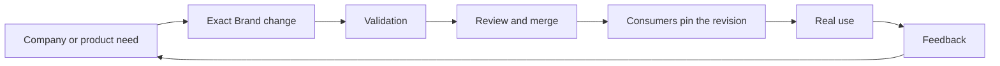

# Contributing

Keep this repository limited to the canonical Mint Shelf identity: approved assets, tokens, guidance, provenance, and their validation.

## Flywheel

Company or product need → exact Brand change → validation → review and merge → consumers pin the revision → real use → feedback → better next need

## Make a change

1. Start from `next` and use a short-lived topic branch.
2. Change the canonical source, manifest, provenance, and guidance together when they describe the same decision.
3. Run `mise run check` and inspect every changed visual asset.
4. Open one pull request whose body explains the change and relevant verification.
5. Merge only after the repository and its consumers agree on the new contract.

Work in progress and campaign-specific creative material belong outside this public repository. Do not silently replace an approved asset or rewrite its provenance.
